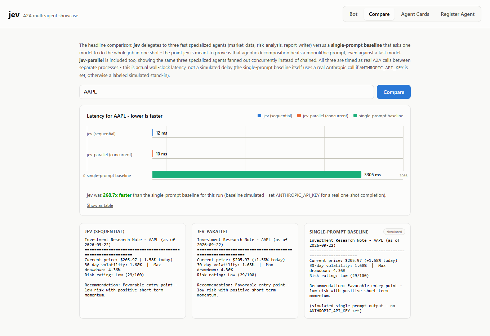
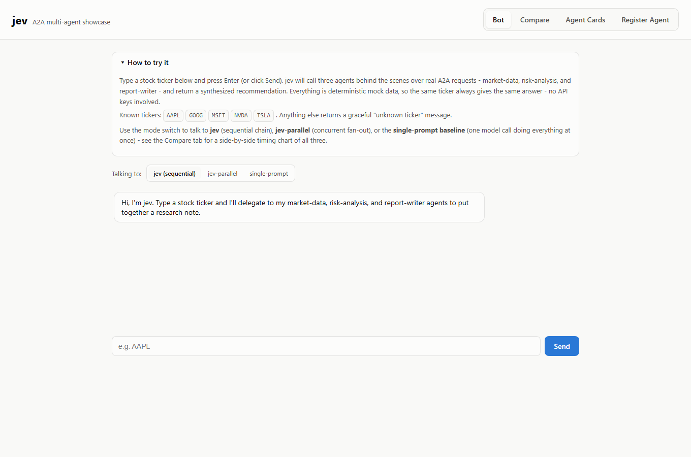
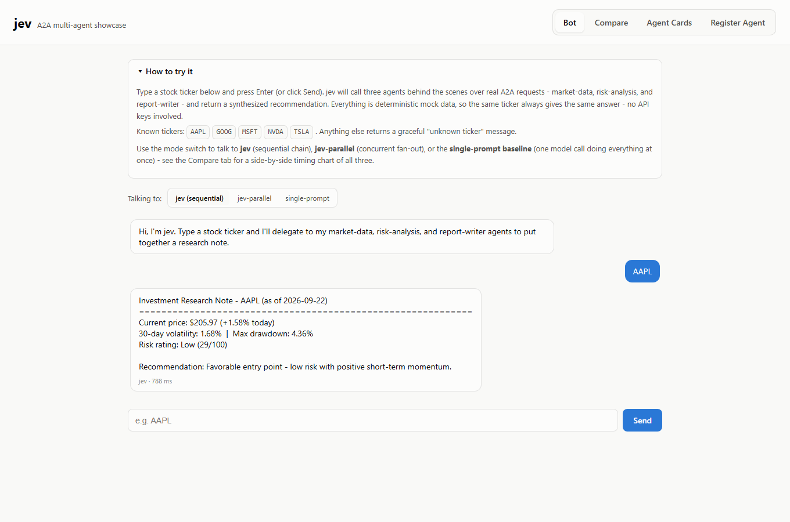
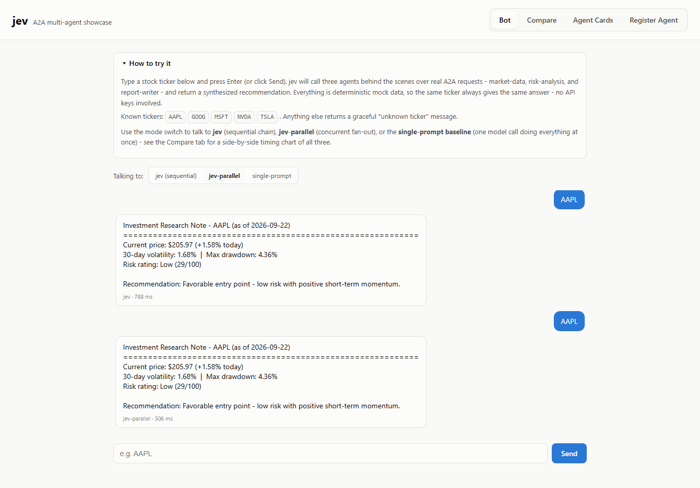
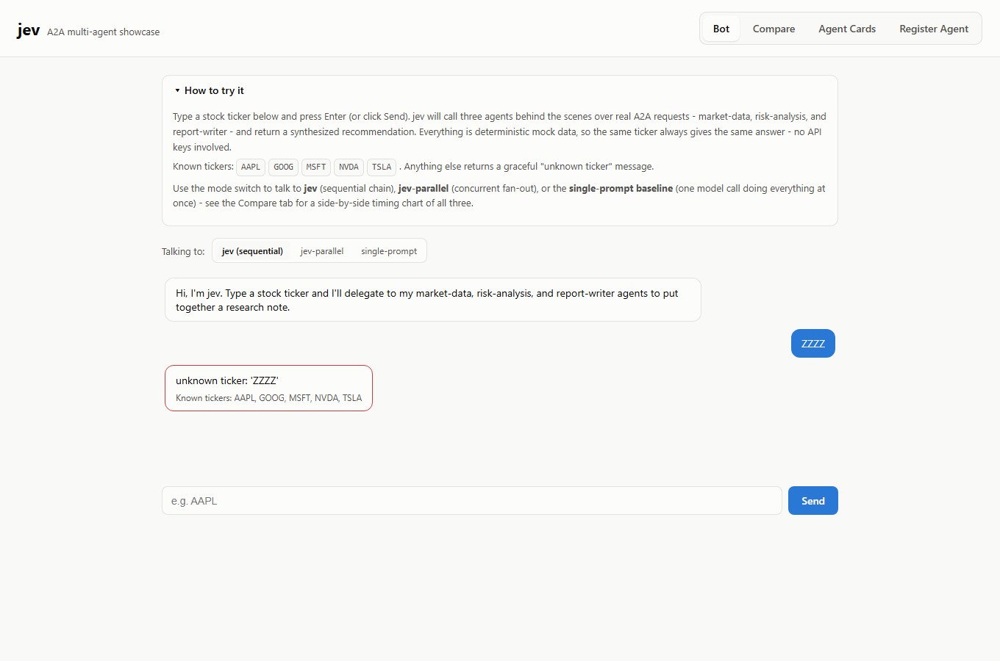
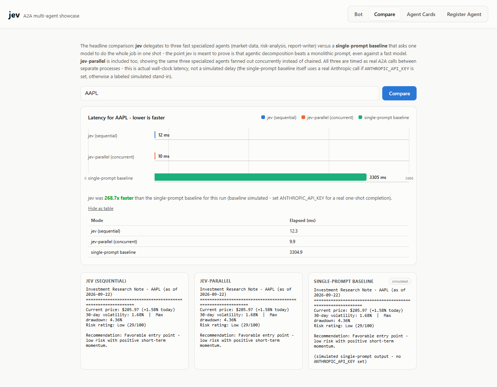
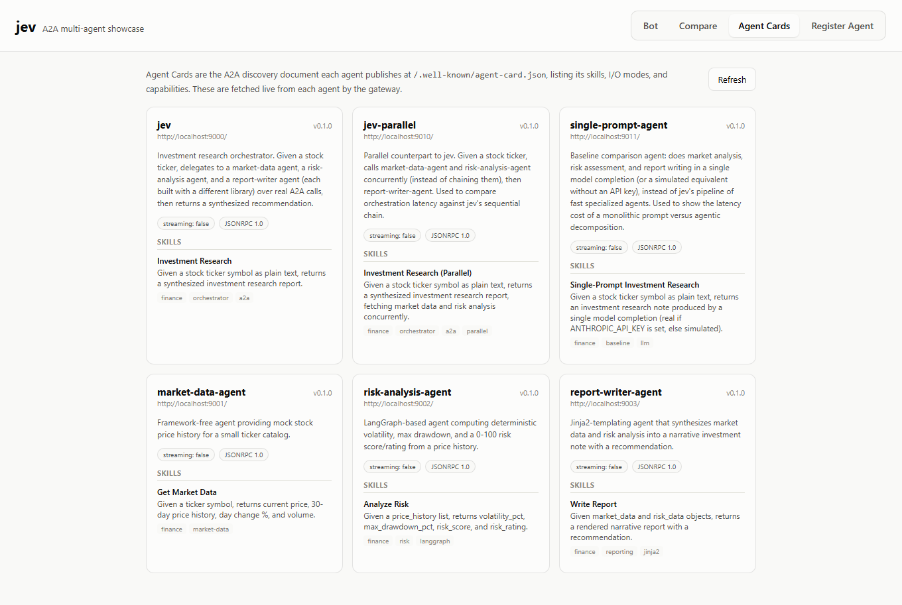
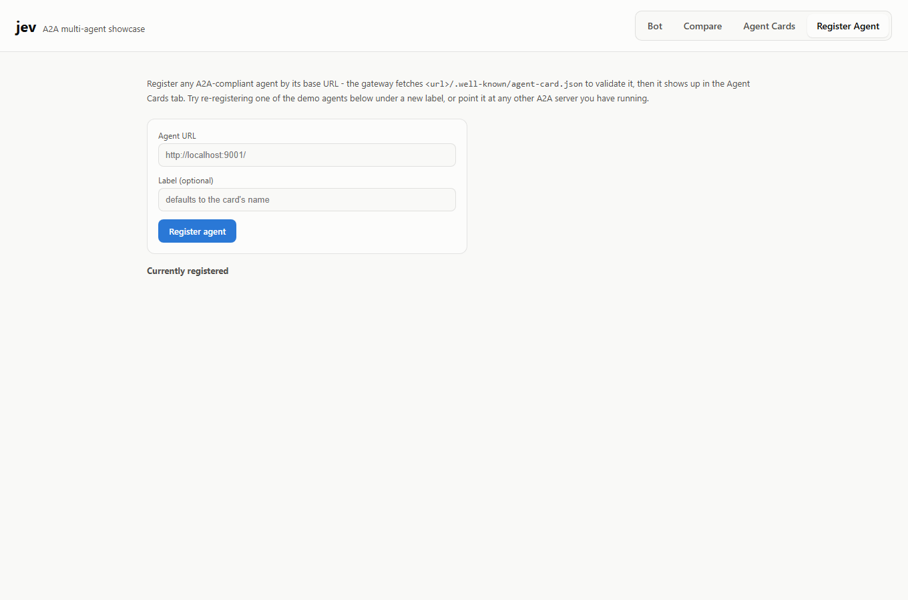
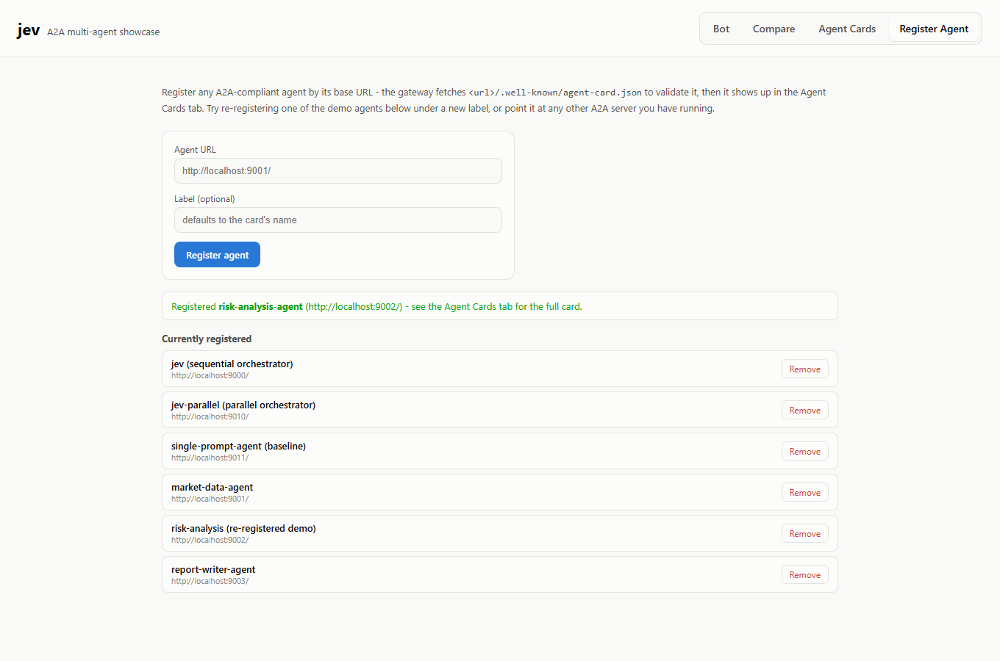

# jev — A2A Multi-Agent Investment Research Showcase

`jev` is an orchestrator agent that demonstrates Google/Linux Foundation's
[A2A (Agent2Agent) protocol](https://a2a-protocol.org/latest/specification/):
a person talks to `jev`, and `jev` delegates work to three independent
sub-agents — each built with a different Python library — over real A2A
HTTP calls between separate processes. The scenario is a small investment
research assistant. All agent "intelligence" is deterministic/rule-based;
nothing here calls an LLM or needs an API key.

The point of this repo is a specific claim: **agentic decomposition beats a
monolithic prompt.** To show that, there are three ways to answer the same
question:

| | What it does | Round trips |
|---|---|---|
| **jev** | delegates to 3 fast specialized agents, one after another | 3 sequential |
| **jev-parallel** | same 3 agents, but the two independent ones run concurrently | ~2 sequential |
| **single-prompt baseline** | one model call tries to do market analysis + risk + writing all at once | 1, but slow |

A **React UI** ties it together: chat with any of the three, browse/register
Agent Cards, and see the timing comparison as a chart.

## Why jev is faster

Screenshot below (AAPL, this machine, see [Screenshots](#screenshots) for the
full set): **jev was 233.5x–268.7x faster than the single-prompt baseline**
for the same query.



This isn't a rigged number — it's the honest consequence of what each side is
actually doing:

- **jev's three agents do no real "thinking."** Market data is a seeded
  lookup, risk is a few arithmetic passes over a LangGraph graph, and the
  report is a Jinja2 template fill. Once each agent's A2A client connection
  is warm, a full 3-hop round trip on localhost is single-digit-to-low-double-digit
  milliseconds (see the `12ms` / `10ms` bars above).
- **The single-prompt baseline pays for open-ended reasoning.** A model
  reading raw numbers and having to work out volatility, drawdown, a risk
  tier, *and* compose prose — in one pass, with no structure to lean on — is
  fundamentally a slower kind of work than three narrow deterministic steps,
  regardless of how fast the model is. This repo's baseline uses
  **Haiku** (Anthropic's fastest model) specifically so the comparison is
  charitable to the baseline, not stacked against it.
- Without an `ANTHROPIC_API_KEY`, the baseline's latency is **simulated** (a
  representative 2–4s delay standing in for a real completion — clearly
  labeled `simulated` in the UI, see `used_real_llm` in the API response).
  Set the key and it makes a real Haiku call instead — in informal testing a
  real single-shot Haiku completion for this task still lands in the
  **1–3 second** range, i.e. jev remains on the order of 100x+ faster because
  the gap is architectural (specialized fast steps vs. one model doing
  everything), not just "simulated delay vs. real delay."
- `jev` vs `jev-parallel` is a smaller, different comparison: both do the
  same specialized work, `jev-parallel` just overlaps two of the three calls,
  so it's consistently a bit faster than `jev` (not orders of magnitude) —
  see the [jev-parallel screenshot](#screenshots) for a same-work, less-waiting
  comparison alongside the bigger architectural one.

## Architecture

```
                                  ┌─────────────┐
 person ──► React UI (:5173) ──► │ web gateway │ (:9020, plain REST, CORS)
                                  └──────┬──────┘
                                         │ real A2A JSON-RPC calls
              ┌──────────────────────────┼───────────────────────────┐
              ▼                          ▼                           ▼
     jev (:9000, sequential)   jev-parallel (:9010, concurrent)  single-prompt-agent (:9011)
              │                          │                           │
 market-data ──► risk-analysis   market-data ┐                one model call (Haiku, real
  (:9001)        ──► report-writer  risk-analysis ├─► report-writer  or simulated) does the
                     (:9003)         (run concurrently)               whole job at once

 person ──► orchestrator/cli.py ──► jev (:9000)   (terminal alternative to the UI)
```

1. You type a ticker (e.g. `AAPL`) into the React **Bot** tab (or the CLI).
2. It's sent to whichever agent you're talking to as an A2A message.
3. **`jev`** calls `market-data-agent`, then `risk-analysis-agent`, then
   `report-writer-agent` — three sequential round trips.
   **`jev-parallel`** calls `market-data-agent` and `risk-analysis-agent`
   *concurrently* (both driven directly off the ticker, so neither waits on
   the other), then `report-writer-agent`.
   **`single-prompt-agent`** skips delegation entirely and asks one model to
   produce the whole report in a single completion.
4. The report comes back through the same chain.

Every hop is a real JSON-RPC request over HTTP between separate processes —
not a function call — and every agent exposes a spec-compliant Agent Card at
`/.well-known/agent-card.json`, implementing the `AgentExecutor` interface
from the official `a2a-sdk` package
([a2aproject/a2a-python](https://github.com/a2aproject/a2a-python)).

The React UI never speaks A2A directly — it talks plain REST/JSON to the
**web gateway**, which is the one piece that uses the real `a2a-sdk` client
to call `jev` / `jev-parallel` / `single-prompt-agent` / any registered
agent. This keeps the protocol demonstration real while keeping the
frontend simple.

## Project layout

```
common/                  shared registry, mock market data, message helpers, server bootstrap
agents/
  market_data_agent/     mock price data — framework-free
  risk_analysis_agent/   volatility/drawdown/risk scoring — LangGraph state graph
  report_writer_agent/   narrative report — Jinja2 template
  single_prompt_agent/   baseline: one model call (real via Anthropic Haiku, or simulated)
orchestrator/            jev: A2A server + sequential A2A client to the 3 agents, + CLI
orchestrator_parallel/   jev-parallel: same skill, but fans market-data + risk-analysis
                         out concurrently via asyncio.gather
web_gateway/             FastAPI REST bridge for the React UI (agent registry, ask, compare)
web/                     React (Vite) UI — Bot / Compare / Agent Cards / Register Agent tabs
docs/screenshots/        UI screenshots (captured with Playwright against the running app)
run_demo.py              launches all 6 backend agents + the gateway, then idles
```

## Setup

This project uses a Python virtual environment shared across projects,
located at `C:\Users\shwet\Code\common\.venv`. Dependencies are pinned in
`requirements.txt`.

```powershell
# from the jev/ project root
C:\Users\shwet\Code\common\.venv\Scripts\pip.exe install -r requirements.txt

# one-time frontend install
cd web
npm install
cd ..
```

**Optional** — to make the single-prompt baseline use a real model instead
of a simulated delay, set an API key before starting the backend:

```powershell
$env:ANTHROPIC_API_KEY = "sk-ant-..."
```

## Running the demo

**Backend** (all 6 agents + the gateway, in one terminal):

```powershell
C:\Users\shwet\Code\common\.venv\Scripts\python.exe run_demo.py
```

Leave this running — press Ctrl+C when you're done to stop every backend
service it started.

**Frontend** (in a second terminal):

```powershell
cd web
npm run dev
```

Open **http://localhost:5173**:

- **Bot** — chat with `jev`, `jev-parallel`, or the `single-prompt` baseline
  (toggle at the top); inline help explains how to use it and lists the
  known tickers.
- **Compare** — enter a ticker, get a bar chart of all three approaches'
  latency for that same query, plus all three rendered reports side by side.
- **Agent Cards** — browse the live Agent Card of every registered agent
  (name, skills, capabilities, interfaces).
- **Register Agent** — register any other A2A agent by URL; the gateway
  fetches and validates its card, then it shows up in Agent Cards too.

**Terminal alternative**, instead of the UI (in a second terminal, after
`run_demo.py` is up):

```powershell
C:\Users\shwet\Code\common\.venv\Scripts\python.exe -m orchestrator.cli
```

Known tickers in the mock catalog: `AAPL`, `TSLA`, `GOOG`, `MSFT`, `NVDA`.
Anything else returns a graceful "unknown ticker" message listing the valid
options, routed all the way back through whichever agent you asked.

## Screenshots

All captured against the actually-running app with headless Chromium
(Playwright), not mocked up.

**Bot tab** — talking to jev, with inline help open:


**Bot tab** — jev's answer for AAPL:


**Bot tab** — same query against jev-parallel, for comparison:


**Bot tab** — an unknown ticker handled gracefully, routed back through jev:


**Compare tab** — the headline result: jev vs jev-parallel vs the
single-prompt baseline for AAPL:


**Compare tab** — same comparison, table view (accessibility fallback) plus
all three rendered reports:


**Agent Cards tab** — all six agents' live A2A Agent Cards:


**Register Agent tab** — empty state:


**Register Agent tab** — after registering risk-analysis-agent under a new
label:


## Verifying the A2A wiring independently

While `run_demo.py` is running, in another terminal:

```powershell
curl http://localhost:9000/.well-known/agent-card.json   # jev
curl http://localhost:9010/.well-known/agent-card.json   # jev-parallel
curl http://localhost:9011/.well-known/agent-card.json   # single-prompt-agent
curl http://localhost:9001/.well-known/agent-card.json   # market-data-agent
curl http://localhost:9002/.well-known/agent-card.json   # risk-analysis-agent
curl http://localhost:9003/.well-known/agent-card.json   # report-writer-agent
curl http://localhost:9020/api/agents                    # gateway's live registry
```

Each agent should return a JSON Agent Card describing its skills. You'll
also see each sub-agent's own console print an incoming request every time
you query a ticker — confirming these are genuine cross-process A2A calls,
and that `jev-parallel`'s two calls land back-to-back rather than one
waiting on the other.

Every FastAPI-backed agent (all of them) also serves interactive Swagger
docs at `/docs`, e.g. http://localhost:9000/docs.

## Running an individual agent

Each agent is independently runnable, e.g.:

```powershell
C:\Users\shwet\Code\common\.venv\Scripts\python.exe -m agents.risk_analysis_agent
C:\Users\shwet\Code\common\.venv\Scripts\python.exe -m agents.single_prompt_agent
C:\Users\shwet\Code\common\.venv\Scripts\python.exe -m orchestrator_parallel
C:\Users\shwet\Code\common\.venv\Scripts\python.exe -m web_gateway
```
